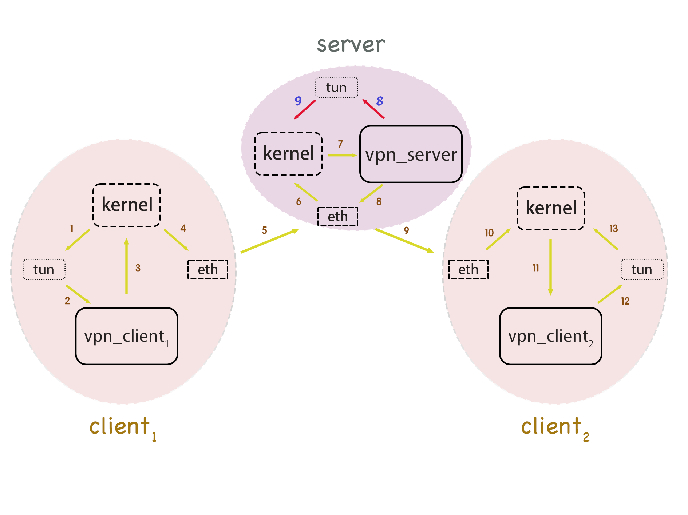

[Switch to the Chinese README](README-cn.md)

# OpenSSL VPN

## Introduction

- A simple SSL VPN for Unix-like systems(Linux, MacOS)
- Designed with a client-server architecture, a vpn_server and multiple vpn_clients form a virtual subnet. When a vpn_client connects to the vpn_server, the vpn_server automatically assigns a virtual IPv4 address to the vpn_client. After that, the vpn_client can access all hosts within the virtual subnet as if they were on a local area network. Communication is encrypted using the OpenSSL library, enabling end-to-end direct communication between two clients under different NATs.

## Architecture



- The blue arrows 1 to 13 indicate the flow of packets between clients, while the blue arrows 1 to 7 and the red arrows 8 to 9 indicate the flow of packets sent from clients to the server (for simplicity, the diagram does not include applications using the VPN, only the communication between kernel protocol stacks is shown). Reversing the direction of the arrows represents the flow of packets in the opposite direction, following the same principle. Communication between physical network cards (blue arrows 5 and 9) is encrypted using SSL/TLS.
- In this project implementation, the vpn_server essentially acts as a gateway between clients, implementing routing functionality at the application layer. Each host creates a network layer virtual network card (tun) and modifies the routing table entries so that packets with destination addresses within the VPN subnet are directed to the tun, allowing the vpn_server and vpn_client to monitor tun traffic and send the intercepted IP packets as payloads into the SSL/TLS connection. Additionally, when the vpn_server and vpn_client receive packets on the SSL/TLS connection with destination addresses within their own VPN internal network, they write them into the kernel protocol stack via the tun, enabling VPN internal network communication. The vpn_server and vpn_client encrypt packets when sending and decrypt them upon receiving, ensuring security.

## Usage

### Dependency

Ensure that CMake is pre-installed on your machine, with a version ≥ 3.28.3 (the default version installed with Ubuntu 24.04 LTS).

### Clone

```
git clone https://github.com/ArtisticFantasy/OpenSSL-VPN.git
```

### Build

```
cd /path/to/OpenSSL-VPN && ./scripts/build.sh
```

### Authentication Preparation

1.&nbsp;Check if the `host.key` and `host.crt` files exist in the `certs/` directory. If not, execute:

```
cd /path/to/OpenSSL-VPN && ./scripts/gen_certs.sh
```

2.&nbsp;Obtain the self-signed certificate of the peer (physically copy the peer's `certs/host.crt`). Assuming it is located at `/path/to/peer.crt`, execute:

```
cd /path/to/OpenSSL-VPN && ./scripts/add_trusted.sh /path/to/peer.crt
```

### Write a Configuration File

Write the configuration file in the following format. You can use "#" as a comment symbol in the file.

```
SERVER_IP = <SERVER_REAL_WORLD_ADDRESS> # Only required for client
PORT = <SERVER_PORT_NUMBER>
EXPECTED_HOST_ID = <EXPECTED_HOST_ID>
```

- For `vpn_server`, `PORT` represents the listening port number (between 10000 and 65535, default value is 54433), and `EXPECTED_HOST_ID` represents its host ID within the VPN subnet (default value is 1).
- For `vpn_client`, `SERVER_IP` represents the actual address of `vpn_server` (must be specified), `PORT` represents the port on the host which the `vpn_server` is listening on (must match the `vpn_server` configuration, default value is 54433), and `EXPECTED_HOST_ID` represents the desired host ID to be assigned (if not specified, the `vpn_server` will decide the host ID). The `vpn_server` will try to fulfill the `vpn_client`'s host ID request unless the corresponding host ID has already been assigned.

You can refer to `config/config.sample` for a configuration file example. If the configuration file location is not explicitly specified through parameters when starting `vpn_server` and `vpn_client`, the default configuration file `config/config` in the project folder will be used (needs to be created manually).

### 运行

#### server

Start the server (you can specify a configuration file) and set the VPN subnet address by executing:

```
cd /path/to/OpenSSL-VPN && sudo ./vpn_server [-c <config_file>] <vpn_subnet_address/prefix_len>
```

The subnet address does not need to be explicitly specified; the vpn_server will use the default address 192.168.20.0/24.

When explicitly specifying the subnet address, please use a local address, and the subnet prefix length must not be less than 16.

#### client

Connect to the server by executing:

```
cd /path/to/OpenSSL-VPN && sudo ./vpn_client [-c <config_file>]
```

## Reference

- [OpenSSL github repository](https://github.com/openssl/openssl)
