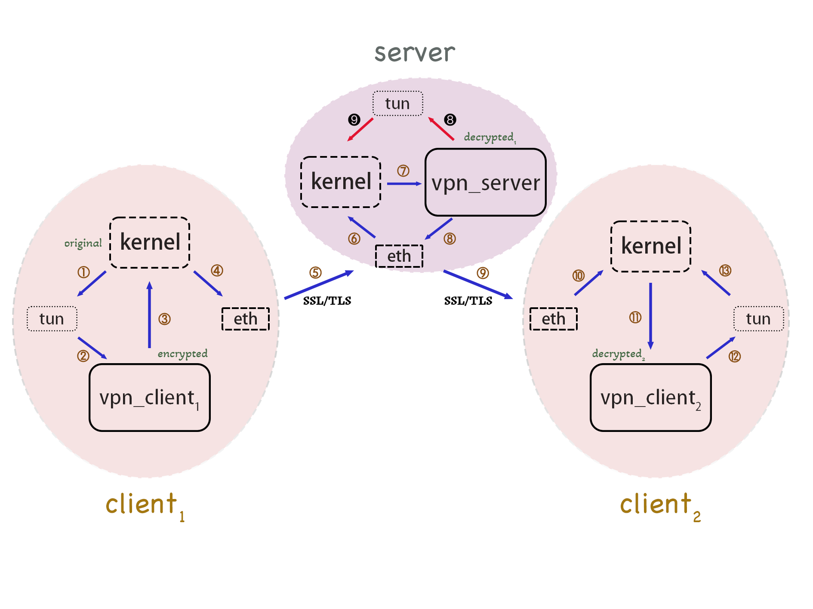

# OpenSSL VPN Demo

## 简介

面向Linux/MacOS的轻量级SSL VPN

一个vpn_server与多个vpn_client之间构成一个虚拟子网，vpn_client与vpn_server建立连接时，vpn_server会自动给vpn_client分配一个虚拟IPv4地址，之后便可按照局域网通信的方式访问虚拟子网内所有主机

vpn_server与vpn_client间采用TLS加密通信，超过一定时间加密链路上无数据传输，则对应连接关闭并释放资源（暂定2000秒）

vpn_server处设有源地址验证机制，防止子网内部伪造源地址

## 实现目标

- 基础目标：虚拟子网内的加密通信
- 扩展目标：代理功能

## 实现阶段

- $\checkmark$ 子网内通信 (已测试icmp echo, ssh)
- $\square$ 代理功能

## 架构图



黄色箭头1到13表示client间通信的报文流向，黄色箭头1到7和红色箭头8到9表示client往server发送报文的流向（为简单起见，图中并没有包含使用VPN的应用，仅体现了内核协议栈间的通信），翻转箭头朝向即是反向通信的报文流向。实体网卡间的通信（黄色箭头5和9）均采用SSL/TLS加密。

在本项目实现中，vpn_server实质上担任了client间的网关，在应用层实现路由功能。各主机均创建了一块网络层虚拟网卡tun，并修改路由表表项使目的地址在VPN子网内的报文均被定向到tun中，以供vpn_server, vpn_client监听tun流量并将劫持到的IP报文作为负载送入SSL/TLS连接中。同时，当vpn_server, vpn_client在SSL/TLS连接上收到目的地址为自己VPN内网地址的报文后，通过tun写入内核协议栈，以实现VPN内网通信。

## 编译

```
./scripts/build.sh
```

## 使用

### 准备

1.检查项目目录下```certs/```中是否存在```host.key```和```host.crt```文件，如果没有，则执行

```
./scripts/gen_certs.sh
```

2.获取peer的自签名证书，假设为```/path/to/peer.crt```，执行

```
./scripts/add_trusted.sh /path/to/peer.crt
```

### 运行

#### server

```
sudo ./build/bin/vpn_server <vpn_subnet_address>/<prefix_len>  (default: 192.168.20.0/24)
```

指定子网地址时请使用local address，子网前缀长度不得小于16位

#### client

```
sudo ./build/bin/vpn_client <server_public_address>
```

## 参考资料

- [OpenSSL github仓库](https://github.com/openssl/openssl)
